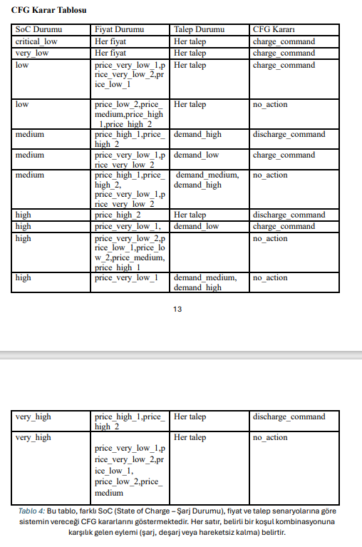

#  V2G-SUMO: Formal Language-Based Vehicle-to-Grid Energy Simulation

This project presents a simulation framework for analyzing the feasibility and efficiency of Vehicle-to-Grid (V2G) technology in a university campus environment using the **SUMO** mobility simulator and formal modeling approaches including **Deterministic Finite Automata (DFA)** and **Context-Free Grammar (CFG)**. 

Developed as part of the *Formal Languages and Automata* course, the project simulates electric vehicle (EV) behaviors  such as charging, discharging, and idle in response to electricity prices, battery State of Charge (SoC), and grid demand, providing a real-time decision-making energy management system (EMS).

---

##  System Architecture Overview

- **Simulation Layer:** SUMO (Simulation of Urban MObility) models the Eskişehir Osmangazi University campus with real traffic infrastructure and vehicle movements.
- **Decision Layer:** A Python-based EMS evaluates SoC, electricity price, and demand at each timestep to determine vehicle energy actions.
- **Control Logic:** DFA governs the transition between charging, discharging, and idle states; CFG formalizes complex multi-parameter decision rules.
- **Communication Layer:** MQTT enables simulation of EV-to-grid communication.
- **Data Logging & Visualization:** Actions and outcomes are logged in XML and visualized using Matplotlib.

---

##  Project Purpose and Impact

The project investigates how V2G systems can:
- Balance **energy demand and supply** within a campus microgrid.
- Reduce **energy costs** by leveraging low-price periods for charging.
- Prevent **grid overloading** by smart discharging during peak hours.
- Contribute to **CO₂ emission reduction** by optimizing energy reuse.

---
##  Project Context & Background

The transportation infrastructure within the Eskişehir Osmangazi University (ESOGÜ) campus is envisioned to be transformed into a sustainable, energy-efficient, and cost-effective system through the integration of **Vehicle-to-Grid (V2G)** technology. With this approach, electric vehicles (EVs) do not only consume electricity but can also supply energy back to the grid during peak hours, enhancing the campus-wide energy management system.

###  Formal Modeling of Energy States

In the proposed V2G system, different energy modes of vehicles charging, discharging (to grid), and idle are modeled using formal language concepts:

- **Deterministic Finite Automaton (DFA)** is used to define clear state transitions, such as:
  - When a vehicle reaches 70% SoC while charging, it may transition to discharging mode.
  - When grid demand drops, it can revert to charging or idle.
  
This provides a predictable and controllable state-machine-based framework for battery behavior.

###  Decision-Making with Context-Free Grammar (CFG)

The **Energy Management System (EMS)** makes real-time decisions based on input from:
- Battery state of charge (SoC)
- Real-time electricity prices
- Grid demand

These decisions follow a set of hierarchical logic rules defined using **Context-Free Grammar (CFG)**. For instance:
> `"If battery level is low AND price is cheap → then charge the vehicle"`

Such formal modeling ensures systematic and structured decision logic, enhancing both energy and economic efficiency.

###  Dynamic Energy Flow Management

The EMS constantly analyzes grid conditions and determines **when and how** EVs should charge or discharge. By evaluating SoC, demand profiles, and temporal patterns, the system dynamically:
- Balances energy flow
- Reduces peak load
- Enhances the efficient use of vehicle batteries

###  Simulation and Validation with SUMO

To validate this structure, the entire energy flow and vehicle behavior within the campus were modeled using **SUMO (Simulation of Urban Mobility)**. The simulation captured:
- Vehicle movements
- Stop durations
- State transitions
- Energy decisions

All actions were governed by the formal EMS logic and visualized with graphs and state logs. As a result, the project presents a safe, scalable, and reliable framework for campus-wide V2G integration.


##  Scenario & Simulation Details

###  Campus Modeling
- A realistic OSM-based SUMO map of the university campus is used.
- EVs follow defined routes and dynamically interact with a charging station.

###  EV Behavior
At each simulation step, the EV:
- Moves along a predefined path.
- Consumes energy proportional to distance.
- Halts at a charging station if in the designated lane.

###  EMS Decision Cycle

1. **Evaluate Battery SoC** (in kWh and %)
2. **Determine Current Hour** (simulated real time)
3. **Get Electricity Price & Grid Demand**
4. **Run CFG-Based Logic** for action selection:
   - `charge_command`
   - `discharge_command`
   - `no_action`
5. **Apply DFA Rules** to prevent unsafe or illogical transitions
6. **Execute Command**, update battery and profit
7. **Log results** in XML and plot data post-run

---

##  Formal Modeling

### DFA: Finite State Control

| Current State | Command             | Next State   |
|---------------|---------------------|--------------|
| Idle          | charge_command      | Charging     |
| Idle          | discharge_command   | Discharging  |
| Charging      | no_action           | Idle         |
| Discharging   | no_action           | Idle         |
| ...           | ...                 | ...          |

**Diagram:**  


### CFG: Grammar-Based Decision Logic

Non-terminal symbols:
- `SoC_Durumu`
- `Fiyat_Durumu`
- `Talep_Durumu`
- `CFG_Kararı`

Rules like:
S → SoC_Durumu Fiyat_Durumu Talep_Durumu CFG_Kararı
SoC_Durumu → low | medium | high | ...
CFG_Kararı → charge_command | discharge_command | no_action


**Example rule:**
If SoC = medium AND price ≥ 28 AND demand = high → discharge_command

---

##  Results & Observations

Based on simulation data:

-  **Total Energy Sent to Grid (V2G):** ~1.50 kWh  
-  **Net Profit:** 1.50 TL  
-  **CO₂ Emissions Avoided:** 4.42 kg  

These outcomes demonstrate that:

- V2G technology enhances **campus-scale energy efficiency**.
- It **reduces peak load pressure** on the local grid.
- It provides **economic gains** through smart energy trading.
- It aligns with sustainability goals by minimizing carbon impact.

---

##  Simulation Outputs

### 1. Simulation Start – EV enters route  

At the beginning of the simulation, an electric vehicle is observed entering the campus road on a predefined route. The vehicle's behavior and its interactions with traffic are dynamically analyzed within this environment.
---

### 2. EMS Decision Example – Discharging  


---

### 3. EMS Decision Example – Charging  


---

### 4. SoC Change Over Time  
Graph shows vehicle battery charging/discharging dynamics with profit and CO₂ savings.


The graph illustrates the change in the battery State of Charge (SoC) of an electric vehicle throughout the simulation. The vehicle discharges energy to the grid during specific time intervals and later recharges. As a result of these cycles, a total profit of 1.50 TL was achieved and 4.42 kg of CO₂ emissions were prevented.
---

### 5. DFA Diagram  
The state transitions between Idle, Charging, and Discharging modeled using DFA.


A Deterministic Finite Automaton (DFA) diagram illustrating the different operating states of the battery management system and the transitions between them based on commands.
---

### 6. CFG Decision Table (Optional Visualization)  
Table showing CFG rule-based decision making for different SoC, price, and demand combinations.



This table shows the CFG decisions of the system based on different SoC (State of Charge), price, and demand scenarios. Each row represents the action (charging, discharging, or no action) corresponding to a specific combination of conditions.
---

### 7. Charging Station View  
A detailed image from SUMO GUI where EV is located at the charging lane.


Entry of the electric vehicle into the route in the SUMO simulation environment
---

### 8. Real-world Map of ESOGÜ Campus  
SUMO map imported from OpenStreetMap for Eskişehir Osmangazi University.


---

##  How to Run

1. Ensure **SUMO GUI** is installed and accessible via CLI.
2. Install required Python packages:
```bash
pip install traci paho-mqtt matplotlib
python arayuz.py
```
##   File Descriptions
| File              | Description                                   |
| ----------------- | --------------------------------------------- |
| `ems_decision.py` | EMS logic using CFG and DFA rules             |
| `deneme.py`       | Main simulation loop with SUMO + MQTT         |
| `osm.sumocfg`     | SUMO configuration file for map, routes, etc. |
| `screenshots/`    | Simulation screenshots                        |
| `sonuclar.xml`    | Auto-generated XML log of decisions           |
| `*.png`           | Visual results from simulation runs           |

##  Conclusion
This project shows that formal languages like DFA and CFG can be practically used to model intelligent decision-making in real-time energy systems such as V2G. The proposed framework not only simulates theoretical concepts but also demonstrates real-world applicability in optimizing energy infrastructure within constrained environments like university campuses.

By using V2G:

Grid flexibility is increased.

Operational costs are reduced.

Environmental sustainability is improved.

